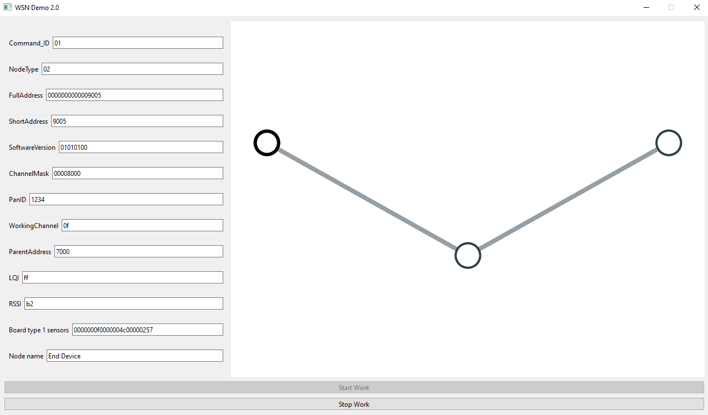

# WSN Demo | Python implementation

Very basic WSN topology visualizer.



## Installation

Use the package manager [pip](https://pip.pypa.io/en/stable/) (for example) to install packages.

```bash
pip install -r requirement.txt
```

## Usage

```bash
python main.py
```

##

## TODO, Bugs, etc.
Note: All sorts of testing is completely missing, the following bugs and errors are result of that (+ bad program design choices, + limited time):
1. **CRITICAL**: Whole program (looks like parser stops working) starts to get very slow all of a sudden. No futher changes in topology can be made and program needs to be restared.
2. **MINOR**: Topology re-draw itself each 10s even there are no changes.
3. **MODERATE**: Stop button doesnt really work (QRunnable cannot be stopped, which was discovered after implementing the whole threading "thing"). This needs complete rework into QThread.
4. **MINOR**: The nodes doesnt have custom images (for Coordinator, Router, End device,..). Fixing this will involve removing MplCanvas and Interactive graph for matplotlib.pyplot and reworking the onclick listener.
5. **MINOR**: The NetworkGraph class is redundant -> implement graph straight in nx.Graph()
6. **MINOR**: The configs for the message struct are not yet suppored, only default can be used.
7. **MODERATE**: UART parser is missing additional data parsing for:
   - Packet Number
   - Time stamp
   - Active period
8. **MINOR**: After initial start of the program, the canvas has 1 node (graph needs to have atleast one node since its creation). This can be fixed by printing white canvas on the start, after start button is clicked, the graph can be shown.
9. **MINOR**: The displayed info is missing some nice conversion of values (board type sensors, etc..)
10. **MINOR**: The whole program is very shallow, there should be some additional tabs with config, logs, etc..
11. **??**: when removing the print statements in the parser, the whole thing just crumbles like a house of cards (honesly, the whole program just needs to be reworked from the ground up, and write tests for each component in the process)

## Documentation:

### main.py
Implements the MainWindow class, which is holder for all the GUI, also holding the threadpool property

There are 2 Workers running (QRunnable) the continuous stuff:
1. **(ParseWorker)** Parsing of the incoming messages (implemented in UART_parser.py)
   - executes the *parse* in the (infinite, until stop button is clicked) loop and recieves data from callback in the *parse* function
   - emits the "progress" signal, when some message is parsed, which is then passed to the *new_data_incoming()* method of the MainWindow.
   - *new_data_incoming()* then transforms node information into dict using the *build_node_information()* (./helpers/parse_output_into_nodeinfo.py), determines if the node needs to be added into the topology, or if some edge needs to be added based on the "ParentAddress" included in the message.
2. **(GraphRebuildWorker)** Redrawing the Canvas with the InteractiveGraph each 10s with current network nodes
   - Every 10s this runner accepts network_graph property of the MainWindow (holds all the current nodes in the graph), and emits the *force_rebuild* signal
   - *force_rebuild* is connected to the *rebuild_canvas()* method, which runs *update_graph(graph.G)* with the current graph (nx.Graph), located in the canvas.py

### Canvas.py
Takes care of creating the InteractiveGraph() with current graph that is passed to this object (MplCavnas, located in MainWindow [self.canvas])

The onclick method is implemented, to call the *update_detail_info* from (./components/detail_info.py), which updates the info bar on the right after node is clicked.

### UART_parser.py
Takes care of reading the data from UART, and parsing them based on loaded config (default.xml) to the whole message (other configs are not realy working yet...)

### Other
There are some helpers implemented in ./helpers/

There is custom image test, which works on the pyplot graph, not the InteractiveGraph :( (in TODO list, number 4)

Also, there is graph.py, which is probably completely useless, however I use it as a "extra" layer above the nx.Graph() API itself, because I wanted to be able to unpack the node_info dict (**node_info) into key-value args for the node.